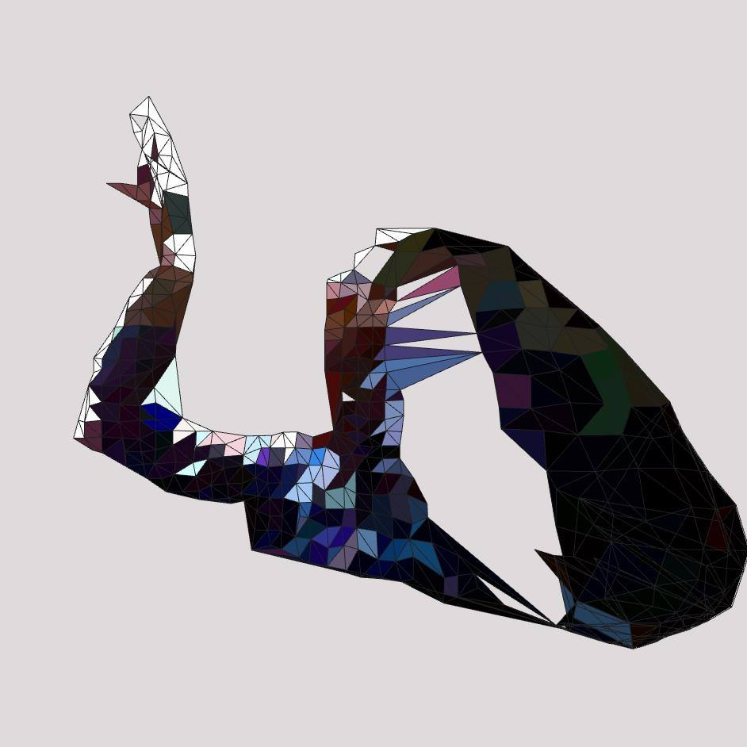

# kinectDelaunay

***i dont plan to do any updates at all for this in the future. so please refrain from asking. but i do want to have fun with this & to hopefully learn something & put it to good use*** 😘👍
  
kinect [v1 model 1414] application that uses delaunay triangulation to make some trippy visuals when you get in front of camera. 
gui can control intensity etc. very easy to use.
  

  
i did learn this from another post somewhere else & made changes down the line. but i cant find the original post. if someone finds it, or knows of it, post an issue & ill look to see if its the same & ill put a link up 👍

## dependancies:

    ofxOpenCv
    ofxCv
    ofxDelaunay
    ofxGui
    ofxKinect

enjoy, have phün & happy separating your waist from your legs due to a freakish Thursday night Delaunay incident 😘

[Lewis Lepton](http://lewislepton.com)

*even though i wont be updating this, i would still love to know if you have made anything using this. so please do post in the [issues](https://github.com/lewislepton/kinectDelaunay/issues) section & put links to what you have made. i love seeing what other people have made using stuff i make available. plus it gives the opportunity for others to see your work somehow* 👍